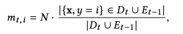
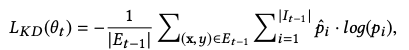
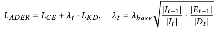
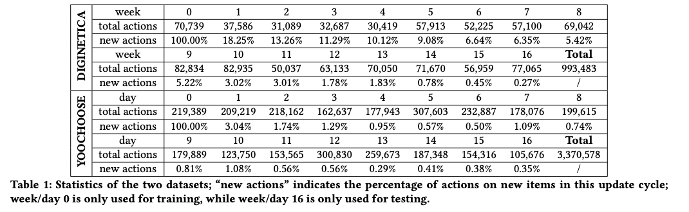

https://dl.acm.org/doi/abs/10.1145/3383313.3412218

## ざっくり内容

### 概要

- Session based recommendation において、継続的に取得されるデータに対して、モデルの破壊的忘却を防ぎながら継続的に学習させ続ける `continual learning` の手法を提案した研究

### 新規性

- Session based recommendation における Continual Learning という課題設定

### 手法

- モデルの破壊的忘却を防ぐために, 以下の 3 つの要素を導入
  - 過去の学習タイミングで取得できたデータの一部を replay する Exampler

    

    - サンプルするデータ数は,クラス(ラベル)毎の出現率に比例して割当て
    - サンプリングアルゴリズムは `herding technique` を使う(incremental learningとかではよく使うみたい？)
      クラス内の中心ベクトルに近いデータをサンプルする奴
  

  - 予測結果の変化に対して制約を設ける Distilation Loss の追加

    

  - Distilation Loss と通常の CE Loss の重みをデータサイズに合わせて adaptive に変化

    

    - 新規データDとExamplerのEの比
    - 1step前と今回のアイテムカテゴリ数(ラベル数)の比

### 有効性の検証

- ベースの Self Attentive Sequential Recomendation(SASrec) に対して上記手法を適応し、
  - 複数のデータセットで Drop Out などの破壊的忘却を防ぐ手法より高い効果があることを確認
  - 継続的学習ではなく、その時点で取得できる全データを利用して学習する手法

## 雑感

- 結構学習時にデータセットの期間ってどうしようかなみたいなのは悩みポイントの１つなので割と実用的な課題設定(さすが[RecSys2020 の Best Short Paper](https://recsys.acm.org/best-papers/))

- experiment の章でやってた各期間における新規アクション数の割合とかによるデータセット自体の評価はたしかにやらなきゃなという気持ち(有名データセットの特徴まとめた研究とかないのだろうか)

  

   datasetでnew action数の比較  
   上の方がnew action数大きい  

- あと base line にあった Drop Out を適用するだけのも普通に実用面では有利そうだった

## その他メモ

- 実装: [GitHub - DoubleMuL/ADER: RecSys 2020](https://github.com/DoubleMuL/ADER)

  tensorflow 1.x + Keras なのがちょっとおもしろい(もとの SASrec が tf1.x 系なのが関係ありそう)
