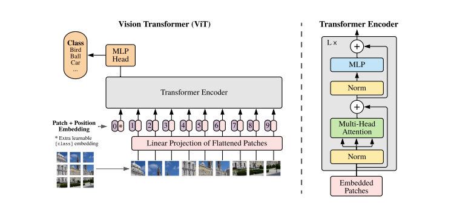
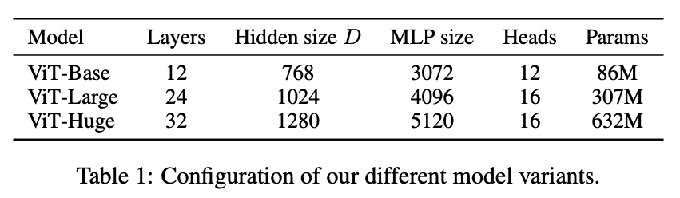
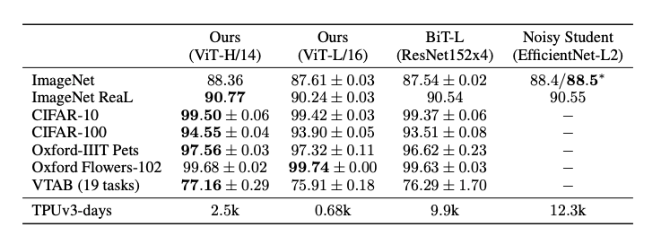
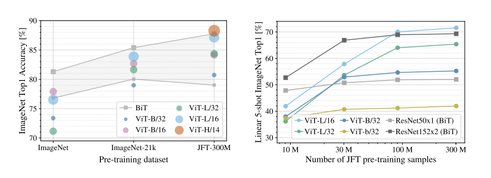
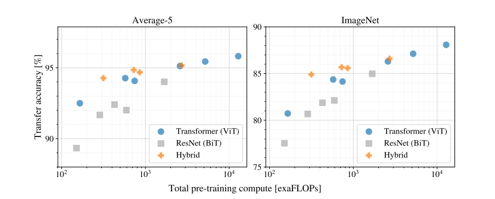
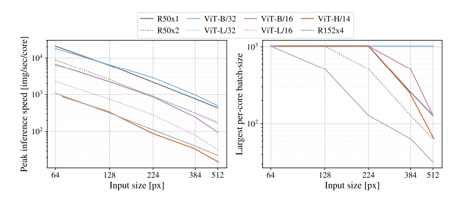
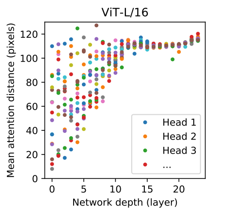
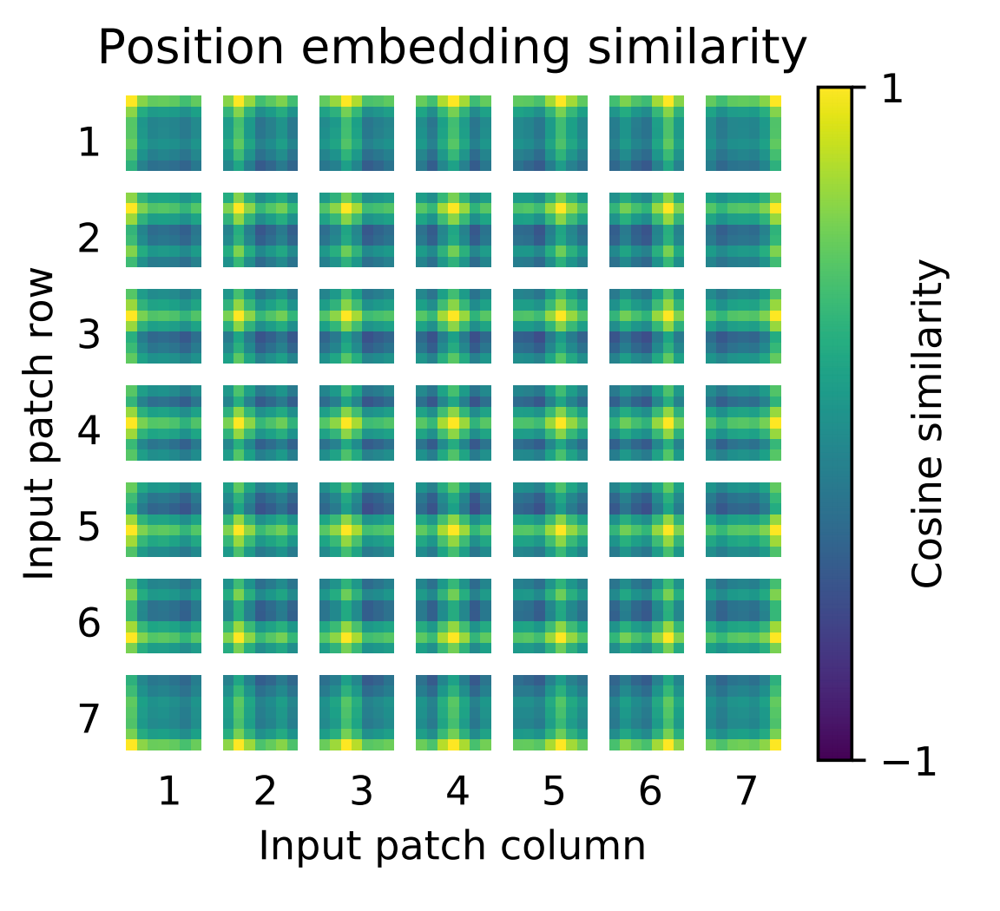
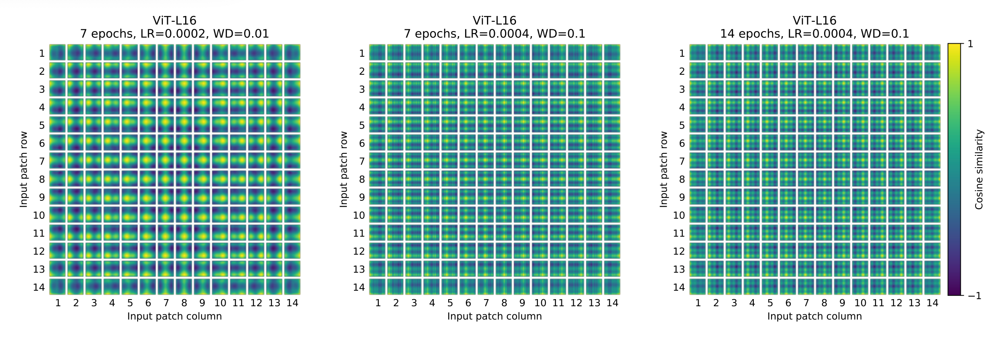
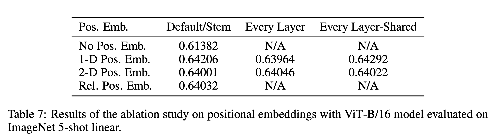

https://openreview.net/pdf?id=YicbFdNTTy

ICLR2021向けのBlind SubmissionでOpen Review中の論文

Blind Submissionとは言うが, [TPU v3](https://cloud.google.com/tpu?hl=ja)と [JFT-300M](https://qiita.com/ikeyasu/items/aefa15e8c329b599fdb2)を利用している時点でGのオーラが隠せていない論文

## ざっくり内容

### 概要

- imageを固定pxサイズに分割したパッチにvisual wordsとし、image全体をパッチのシーケンスとして、Transformerに入力するモデル(Vision Transofmer)を提案。
- このViTをJFT-300Mのような大規模データセットでpretrainすることで、downstream taskにおいてBigTransfer(ResNetベース)やEfficientNetより低い計算コスト(推論時スループット及び訓練時間の観点)で同等以上の精度が達成できることを確認した

### 新規性

- 完全にCNNを排除したシンプルなTransformerのアーキテクチャでCNNベースのモデルを超える精度が出たのは初
- ViTにおいて、ImageNetではデータ数が足りないが大規模データセットによるpretrainによってCNNのような局所性やシフトインバリアントな特徴をアーキテクチャに組み込まなくても学習ができることを明らかにした点

### 手法

- 基本的にはSimpleなTransformer
  - 固定のパッチサイズに画像を分割
  - Position Embeddingは固定ではなく学習ベース
- 特徴的な点は以下の通り
  - シーケンスの先頭にはClassトークンを入れる。
  - classトークンのネットワークの出力で画像ラベルを分類するSupervised Taskで学習をする(Masked LMのようなSelf-supervisedでの学習はしない)
  - 解像度の異なる画像を入力とする際はパッチサイズは固定のまま、Position Encodingの値を線形補間で与える。

  

- Conifgurationはこんな感じ

  

- 入力を生の画像ではなくResNetをbackboneとしたFeatureMapを入力としたHybirdModelも実験

### 実験

- ImageNetやJFT-300Mを組み合わせた大規模データセットでモデルをpretrained
- BigTransfer(ResNet152x4)やNoisyStudent(EfficientNet-L2)とかと各種down stream taskで比較

  

  Noisy Studentに匹敵する精度を達成しながら、Pretrainにかかる時間は他のモデルより大分抑えられている(とはいえこのTPUv3-days 2.5kってどんなパワーやねん)

- pretrainのデータセットのサイズを変化させながら比較

  

  JFT-300M位までデータセットを拡張すればViTの効果が出てくる感

- JFT-300Mでpretrainした場合のcomputation cost

  

  同じcomputation cost for pretrainでViTがResNetベースに勝っている  

- Appendixにある入力解像度別の推論のスループットと, 最大バッチサイズ(TPU v3ベースの1コア当たりの値)

  

  スループットとメモリフットプリント共にViTが高効率  
  (とはいえTPUv3での大規模バッチ前提なので、このパフォーマンスを出せるユースケースはどれだけあるのか不明)

- レイヤ毎の各Attentionの重み付き平均距離

  

  浅いレイヤでは近場, 深いレイヤでは広範囲というのはCNNにおけるReceptive Fieldと似たような傾向

- Position Embedddingが面白い傾向を示してる
  - hand craftedなEmbedding手法(1d base, 2d base, relative distance base)より学習した方が基本的に性能が良かった
    - 学習したembeddingを見ると, 同じcolumn/rowのsimilarityが高い
    - また離れた距離のsimが高くなるようなsin並のような傾向も見られる(←これがhand craftedなembedding構造の効果が低い理由と筆者は言及)
    
  - ただ割とSimilarityはEmbeddingはHyper Parameter変わると大きく傾向が変わるので、この構造自体にはそれほど重要な意味はなさそう
    
  - またposition embeddingは合ったほうが精度は向上するが、そのembedding手法を1D-2D-relativeと変えても精度は対して変わらない。  
    筆者ら的には patch に分割した入力程度の解像度の空間であれば埋め込み方法による差は対してないのではという話
    

## 雑感

- ClassificationタスクにおいてはTransformerに置き換えることも可能かもしれないと思うようなガチの性能だった。  
  アーキテクチャが非常にシンプルなので改善の余地はあり

- このナイーブな実装では, CNN抜きでSegmentationのようなタスクを置き換えられるようなアーキテクチャにはなっていなさそう

- ViTはデータセットが非常に必要な課題がある。データセットのサイズで殴るよりdomain specificなアーキテクチャの方が効率は良いはず？完全なTransformerではなくて、Deformable Convのような可変Receptive FieldのCNNとかがこのTransformerとCNNの橋渡しになってくれたりしないかなという気持ち。(とはいえ、普通に全部置き換えられそう)
